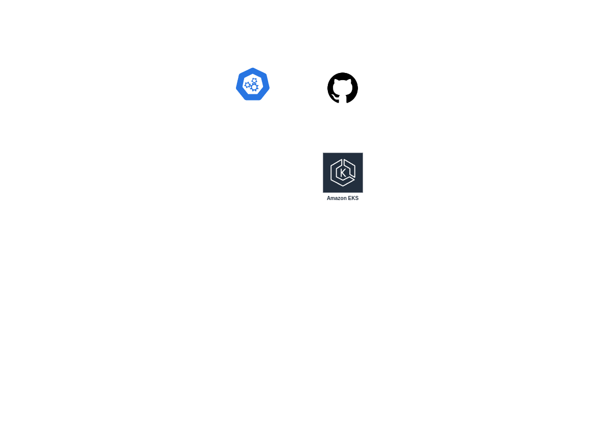

# data-eng-challenge-globant

Globant's data engineering coding challenge for Cesar Mendez

## Repo description

This repository encompasses all the code for globant code challenge. 

## Overview of the Architecture

1. Stage
2. Stage
3. Stage
4. Stage
5. Stage

### TBD(To Be Determined)
1. Automation, CI/CD for updated on the repo and amazon EKS

